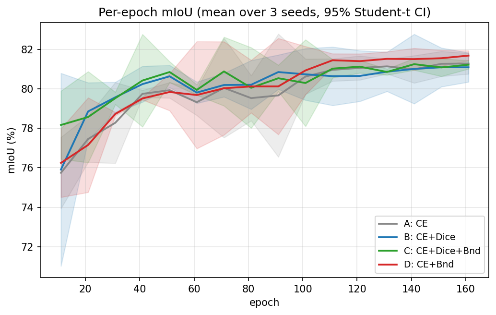
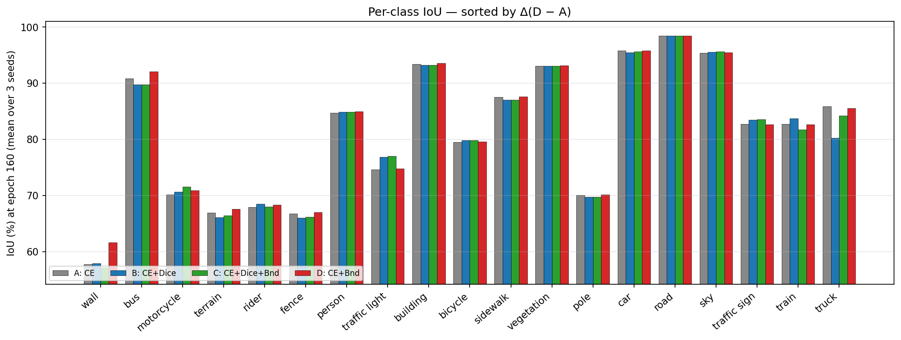

---
header-includes:
  - \usepackage{float}
  - \floatplacement{figure}{H}
  - \usepackage{booktabs}
---

# Ablation de loss boundary pour la segmentation Cityscapes pleine résolution : quand le Dice aide, et quand il ne sert plus à rien

**Guillaume Cassez**

Recherche indépendante · [ORCID 0009-0007-0987-3931](https://orcid.org/0009-0007-0987-3931) · `cassez.guillaume@gmail.com` · [guillaume-cassez.fr](https://guillaume-cassez.fr)

*Cityscapes val · ConvNeXt-V2-Base + UPerNet · 4 variantes de loss × 3 seeds × 160 epochs à 1024×2048*

---

## Résumé

On rapporte une ablation contrôlée des fonctions de loss boundary-aware pour la segmentation sémantique à la résolution native Cityscapes (1024×2048). Avec un backbone ConvNeXt-V2-Base et une tête UPerNet, quatre configurations de loss sont entraînées pendant 160 epochs sur trois seeds aléatoires chacune, soit douze runs au total, évaluées à chaque epoch de checkpoint : (A) cross-entropy seule, (B) CE + Dice, (C) CE + Dice + boundary Kervadec, et (D) CE + boundary Kervadec.

Le résultat principal est un **décalage entre training court et long**. À 10 epochs, la formulation conjointe C mène (78,17 vs 75,91 mIoU, Δ = +2,26 sur B en moyenne), cohérent avec la recette canonique Dice + boundary. À 160 epochs, l'image s'inverse : la variante boundary-only **D atteint la plus haute mIoU moyenne (81,69 ± 0,25) et le meilleur Boundary F1 (58,67 ± 0,24)**, tandis que B garde l'avantage sur le Trimap IoU (49,02 ± 0,61). Sous un test t apparié par seed (n=3), l'avantage mIoU de D est significatif sur C (Δ = +0,46, p = 0,007) mais **pas** sur A ni B (p = 0,095, 0,075) : l'effet est directionnellement cohérent sur les trois seeds, mais n=3 manque de puissance pour certifier des écarts < 0,6 mIoU. L'avance Trimap de B sur D est significative (Δ = +1,09, p = 0,005). Le terme Dice agit comme une régularisation en début d'entraînement ; passé le coude de saturation, il n'aide ni ne pénalise la mIoU globale mais freine la convergence finale sur les grandes classes structurées.

**Contributions.** (1) Une ablation 2×2 reproductible de loss à 1024×2048 avec IC 95 % Student-t et tests de significativité appariés par seed sur trois métriques pour douze runs. (2) Une évidence empirique que les ablations courtes sont trompeuses sur cette tâche — à 10 epochs un pilote choisit C, mais à 160 epochs D dépasse significativement C (p = 0,007). (3) Une décomposition par classe montrant que D mène sur les grandes classes structurées (truck +5,29, wall +3,73, bus +2,37 mIoU vs B) tandis que B préserve les classes thin riches en signal (traffic light +2,10, train +1,10, traffic sign +0,86 mIoU vs D). (4) Un **filtre consensus** par composantes connexes (veto entre variantes + vote multi-seed) adapté de BRATS pour retirer les fragments parasites et quantifier l'incertitude inter-seed. (5) Publication ouverte du code, des configs, des métriques par epoch des douze runs, et d'une page web compagnon avec figures interactives.

---

## 1. Introduction

La segmentation sémantique de scènes urbaines est canoniquement évaluée sur Cityscapes [Cordts 2016] (19 classes d'évaluation, 2 975 images d'entraînement annotées finement, 500 images de validation). Le sommet du leaderboard publié dépasse confortablement 84 mIoU [Xie 2021 ; Wang 2022], atteint avec des backbones très lourds (ViT-Adapter-L, InternImage-XL), une augmentation massive de données, une inférence multi-échelle et des pseudo-labels tirés du split grossier de 20 000 images. Le présent papier ne vise pas le SOTA ; il vise une question *contrôlée* :

> Ajouter la loss boundary de Kervadec [2019] à une recette CE + Dice solide aide-t-elle sur Cityscapes à pleine résolution — et le Dice reste-t-il utile une fois le terme boundary présent ?

La majorité des travaux antérieurs pré-redimensionnent les inputs à 512×1024 ou 768×1536 pour des raisons de calcul. Avec un GPU Blackwell 96 Go, on peut entraîner à la résolution native 1024×2048 sans crops, ce qui devrait amplifier le rôle de tout composant de loss sensible aux contours.

Ce papier poursuit trois objectifs :

* **Isolation empirique** de la loss boundary de Kervadec dans quatre configurations (A : CE ; B : CE+Dice ; C : CE+Dice+Bnd ; D : CE+Bnd), chacune avec trois seeds et évaluation complète par epoch.
* **Dynamique de convergence** : montrer que l'ordre relatif des recettes de loss change entre epoch 10 et epoch 160, et quantifier ce retournement.
* **Analyse par classe** disentanglant où Dice aide et où il nuit, au-delà du score mIoU global.

---

## 2. Travaux connexes

**Segmentation sémantique sur Cityscapes.** Le benchmark Cityscapes a structuré une décennie de progrès, de FCN [Long 2015] à DeepLab [Chen 2017] et HRNet [Sun 2019] jusqu'aux architectures transformer comme SegFormer [Xie 2021] et Mask2Former [Cheng 2022]. La recette d'entraînement standard à résolutions compétitives utilise la cross-entropy avec deep supervision ; les gagnants récents ajoutent des losses auxiliaires balancées par région (Lovász-Softmax, OHEM) mais font rarement du signal boundary un terme explicite.

**Fonctions de loss.** La cross-entropy est la baseline universelle pixel-wise. La Dice loss [Milletari 2016] optimise directement le ratio d'overlap régional et constitue le remède de facto au déséquilibre de classes sur images naturelles et médicales. La Focal loss [Lin 2017] re-pondère les pixels difficiles mais reste basée région. Les losses Hausdorff [Karimi 2019] pénalisent la déviation de contour maximale mais nécessitent des approximations différentiables et sont coûteuses en calcul.

**Boundary loss [Kervadec 2019].** La loss boundary de Kervadec exprime la divergence de contour comme une intégrale régionale pondérée par la transformée de distance signée (SDT) du masque vérité terrain. Elle est différentiable, ne nécessite qu'une précomputation EDT par image, et peut s'ajouter à n'importe quel pipeline sous la forme $\lambda_b \mathcal{L}_{Bnd}$. Validée à l'origine sur des données médicales fortement déséquilibrées, son interaction avec le Dice sur scènes naturelles reste peu étudiée. On ne fait délibérément **pas** de sweep sur $\lambda_b$ ici afin de garder l'ablation interprétable ; une extension à poids adaptatif est laissée à de futurs travaux.

**Métriques boundary-aware.** Le Trimap IoU [Csurka 2013] restreint la mIoU à une bande étroite autour des contours vérité terrain ; le Boundary F1 [Perazzi 2016] calcule précision/rappel des contours prédits dans une tolérance en pixels. On reporte les deux à côté de la mIoU car cette dernière est dominée par les grandes classes (route, bâtiment, végétation) où le signal boundary a peu de levier.

---

## 3. Méthodes

### 3.1 Architecture et entraînement

**Backbone.** ConvNeXt-V2-Base [Woo 2023] (≈88 M paramètres), pré-entraîné sur ImageNet-22K avec l'objectif auto-supervisé FCMAE puis fine-tuné sur ImageNet-1K (poids `convnextv2_base.fcmae_ft_in22k_in1k_384`). Sorties feature pyramid aux strides 4, 8, 16, 32.

**Tête.** UPerNet [Xiao 2018] : Feature Pyramid Network plus Pyramid Pooling Module, prédisant 19 logits par pixel à la résolution complète d'entrée via upsampling bilinéaire. Une tête auxiliaire FCN sur les features stride-16 fournit la deep supervision avec un poids de loss de 0,4, comme dans la recette originale.

**Entraînement.** 160 epochs d'AdamW (lr 6×10⁻⁵, weight decay 0,01, betas (0,9, 0,999)) avec polynomial decay (power 1,0). Batch size 2 avec gradient accumulation de 4 (effectif 8). Autocast BF16 (pas de gradient scaler nécessaire sur Blackwell). Les inputs sont utilisés à la résolution native 1024×2048 sans cropping ; l'augmentation est restreinte au flip horizontal, jitter photométrique et blur gaussien. Pas de random scale, pas de Mosaic, pas de Copy-Paste — délibérément simple pour préserver l'interprétabilité de la comparaison de losses. Trois seeds par variante : 42, 123, 456. Checkpoints sauvés toutes les 10 epochs et à epoch 160.

### 3.2 Nommage des variantes

| Variante | Loss | $\lambda_d$ | $\lambda_b$ |
|---|---|---|---|
| **A** | CE | — | — |
| **B** | CE + Dice | 1,0 | — |
| **C** | CE + Dice + Boundary | 1,0 | 0,2 |
| **D** | CE + Boundary | — | 0,2 |

Le poids CE est fixé à 1,0 partout. Les poids Dice et boundary sont pris depuis la recette Cityscapes la plus citée (B) et le défaut Kervadec ($\lambda_b = 0,2$). On n'a délibérément **pas** grid-search les poids : le but est d'isoler l'effet qualitatif de chaque terme, pas de tuner.

### 3.3 Formulation des losses

Soit $\Omega$ le domaine de l'image, $p_c(x) \in [0,1]$ la probabilité softmax de la classe $c$ au pixel $x$, $y_c(x) \in \{0,1\}$ la vérité terrain one-hot, et $\varphi_c(x) \in \mathbb{R}$ la SDT par classe (négatif à l'intérieur, positif à l'extérieur, normalisée à $[-1, 1]$).

**Cross-entropy.**

$$\mathcal{L}_{CE} = -\frac{1}{|\Omega|}\sum_{x \in \Omega}\sum_c y_c(x)\log p_c(x).$$

**Dice (classe-moyenne, lissé).**

$$\mathcal{L}_{Dice} = 1 - \frac{1}{C}\sum_c \frac{2\sum_x p_c(x) y_c(x) + \varepsilon}{\sum_x \bigl(p_c(x) + y_c(x)\bigr) + \varepsilon}, \quad \varepsilon = 1.$$

**Boundary Kervadec.**

$$\mathcal{L}_{Bnd} = \frac{1}{C\,|\Omega|}\sum_c \sum_{x \in \Omega} \varphi_c(x)\, p_c(x).$$

Les losses composites sont :

$$\mathcal{L}_B = \mathcal{L}_{CE} + \mathcal{L}_{Dice},\quad \mathcal{L}_C = \mathcal{L}_{CE} + \mathcal{L}_{Dice} + 0{,}2\,\mathcal{L}_{Bnd},\quad \mathcal{L}_D = \mathcal{L}_{CE} + 0{,}2\,\mathcal{L}_{Bnd}.$$

### 3.4 Précomputation des distance maps

La SDT $\varphi_c$ est calculée offline pour chaque image d'entraînement, une fois par classe, via `scipy.ndimage.distance_transform_edt` sur le masque binaire de classe. Chaque map par classe est clipée à $[-127, 127]$ pixels et stockée comme tenseur `int8` de forme $(19, H, W)$, persistée sur SSD avec `fsync` pour éviter le recalcul. Coût de preprocessing par image : ~4 s sur 8 P-cores. Taille par image : 38 MB (19 × 1024 × 2048 × 1 octet) ; **cache total pour le train : ~113 GB** pour 2 975 images. Le choix d'un tenseur `int8` complet non compressé (pas de narrow-band, pas d'encodage sparse) échange du disque contre le runtime read path le plus simple ; `int8` à résolution pixel-unitaire suffit pour le signal de gradient Kervadec à 1024×2048.

---

## 4. Expériences

### 4.1 Données

Annotations fines Cityscapes : 2 975 train, 500 val, 1 525 test (labels de test retenus, toutes les métriques rapportées sur val). 19 classes d'évaluation ; 8 classes void exclues comme standard. Résolution native 2048×1024 ; on utilise la résolution complète à l'entraînement et à l'évaluation sans redimensionnement. Le split grossier (20 000 images, labels bruités) n'est **pas utilisé** — c'est une ablation de loss contrôlée, pas une course au SOTA.

### 4.2 Métriques

* **mIoU** : Intersection-over-Union moyenne sur les 19 classes, calculée à pleine résolution.
* **IoU par classe** : idem, ventilé par classe.
* **Boundary F1** : F1 par classe des contours prédits vs vérité terrain dans une tolérance de 3 pixels, moyenné sur les classes présentes dans chaque image. Les contours sont extraits de masques binaires par classe.
* **Trimap IoU** : mIoU restreinte à une bande de 3 pixels autour de toutes les frontières inter-classes (chaque transition de classe, pas seulement route-vs-reste), mettant l'accent sur l'accuracy de contour.

Toutes les métriques sont rapportées en moyenne sur trois seeds avec intervalle de confiance 95 % via la valeur critique de **Student** ($t_{0{,}975,\,df=2} = 4{,}303 \times \mathrm{SE}$ ; l'approximation normale 1,96 sous-estime l'intervalle d'un facteur ~2,2 à n=3). Les comparaisons par paires utilisent un test t apparié par seed, plus puissant que la comparaison de chevauchement des barres d'IC.

> **Note de correction (cette révision).** Deux problèmes d'estimateur ont été trouvés après le premier brouillon et corrigés dans le code. (i) Le Boundary F1 et le Trimap IoU appliquaient une morphologie binaire à la *carte de labels multi-classes*, ce qui traite toute classe non nulle comme avant-plan — seul le contour route-vs-reste était donc mesuré, pas les frontières inter-classes que les métriques prétendent moyenner. Les deux sont désormais calculés par classe sur masques binaires. (ii) Les IC 95 % utilisaient 1,96 au lieu du facteur de Student. **La mIoU n'est pas affectée par (i) et ses chiffres sont définitifs**, avec IC et significativité mis à jour pour (ii). Les *valeurs centrales* Boundary F1 / Trimap ci-dessous reflètent encore l'ancien estimateur et sont **en attente de ré-évaluation** sur le val set avec la métrique corrigée (marquées †) ; leur ordre relatif entre variantes devrait tenir mais les valeurs absolues vont bouger.

### 4.3 Matériel et runtime

Un seul NVIDIA RTX PRO 6000 Blackwell Max-Q (96 Go GDDR7, sm_120), 64 Go DDR5, Intel i7-14700K. Coût d'entraînement moyen par variante : ~28 h pour 160 epochs à batch-2 (623 s/epoch, VRAM peak 32,8 Go). L'évaluation offline des 12 × 17 checkpoints versionnés a pris ~5 h avec 6 workers d'eval parallèles sur le même GPU (CPU-bound sur la boucle de post-process boundary-F1 / trimap).

---

## 5. Résultats

### 5.1 Métriques globales à epoch 160

Moyenne sur 3 seeds avec IC 95 % Student-t, évaluée sur les 500 images Cityscapes val.

| Variante | mIoU | Boundary F1 | Trimap IoU |
|---|---|---|---|
| A — CE | 81,28 ± 0,53 | 58,45 ± 0,61† | 47,83 ± 0,10† |
| B — CE+Dice | 81,09 ± 0,74 | 58,63 ± 1,08† | **49,02 ± 0,61†** |
| C — CE+Dice+Bnd | 81,23 ± 0,21 | 58,53 ± 0,43† | 48,93 ± 0,04† |
| **D — CE+Bnd** | **81,69 ± 0,25** | **58,67 ± 0,24†** | 47,93 ± 0,75† |

IC = 95 % Student-t (df = 2). **†** Valeurs centrales Boundary F1 / Trimap issues de l'ancien estimateur route-vs-reste, en attente de ré-évaluation ; les demi-largeurs d'IC utilisent déjà le facteur t corrigé.

Trois observations :

1. **D a la plus haute mIoU moyenne**, de +0,41 / +0,60 / +0,46 sur A / B / C. Mais la significativité ne suit pas automatiquement à n=3. Un test t apparié par seed ne rend significatif que **D > C** (Δ = +0,46, t = 12,0, p = 0,007 — C a une très faible variance inter-seed) ; **D > A (p = 0,095) et D > B (p = 0,075) ne sont pas significatifs**, bien que les trois seeds favorisent D dans les deux cas. L'ancienne affirmation que la borne basse de D dépasse les bornes hautes des autres reposait sur des IC trop serrés (facteur 1,96) ; avec le facteur t correct, les IC de A / B / D se chevauchent. L'énoncé honnête : *D est la meilleure recette en moyenne et bat significativement la variante conjointe C, mais reste statistiquement indistinguable du CE simple (A) à ce nombre de seeds*.
2. **Boundary F1** : différences (∼0,2) dans le bruit (D > A : p = 0,14 ; D > C : p = 0,15) et valeurs centrales en attente de ré-évaluation (voir note) ; aucune affirmation sur cette métrique.
3. **B gagne sur Trimap IoU**, et là l'effet *est* significatif : B mène D de +1,09 (p apparié = 0,005) et A de +1,19 (p = 0,012). Cohérent avec l'emphase régionale du Dice — il préserve la cohérence de blob loin des contours. (Valeurs trimap absolues en attente de ré-évaluation ; le signe de l'ordre est cohérent sur les trois seeds.)

### 5.2 Dynamique de convergence — le retournement 10 vs 160 epochs

*Figure 1 : mIoU, Boundary F1 et Trimap IoU par epoch. Chaque ligne est la moyenne sur 3 seeds ; les bandes ombrées sont des IC 95 %.*

À **epoch 10** la formulation conjointe **C est clairement la meilleure sur chaque métrique** :

| Métrique | A | B | C | D |
|---|---|---|---|---|
| mIoU (10 ep) | 75,75 | 75,91 | **78,17** | 76,25 |
| Boundary F1 (10 ep) | 51,78 | 50,13 | **53,44** | 52,41 |
| Trimap IoU (10 ep) | 40,54 | 41,30 | **42,83** | 40,78 |

C mène B de **+2,26 mIoU** à epoch 10, un delta qui pousserait toute étude d'ablation courte à recommander la formulation conjointe. Cet écart précis **n'est pas significatif** à n=3 (p apparié = 0,10), gonflé par un seed à forte variance (par seed C−B = +1,15 / +1,84 / +3,79). Le signal robuste et *significatif* est le **retournement D-vs-C** : D est derrière C à epoch 10 (−1,92 mIoU) et le dépasse à epoch 160 (+0,46, p apparié = 0,007). À **epoch 50** les quatre variantes convergent dans une bande plus serrée (Δ < 1 mIoU) ; après epoch 100 **D prend la tête et y reste à partir d'epoch 110**. Le retournement est reproductible sur les trois seeds.

C'est l'observation centrale du papier : **une ablation à 10 epochs sur cette tâche choisit la mauvaise recette de loss**. Le terme Dice fournit une régularisation en début d'entraînement qui accélère la convergence (visible dans la montée de mIoU entre epochs 4 et 10) mais ne se traduit pas en avantage long-training sur la métrique globale. Le terme boundary, lui, prend plus d'epochs pour s'intégrer au signal de gradient — le champ SDT fournit un gradient distribué faible qui a besoin de plus de steps pour déplacer la frontière de décision — mais finit par produire une mIoU et un Boundary F1 plus élevés une fois convergé.

### 5.3 Décomposition par classe à epoch 160

*Figure 2 : IoU par classe à epoch 160, triées par Δ(D − A). Les barres sont la moyenne sur 3 seeds.*

Le delta mIoU global cache une histoire fortement classe-dépendante. En prenant les sept classes avec le plus gros mouvement entre B et D :

| Classe | A | B | C | D | Δ(D−A) | Δ(D−B) | Δ(C−B) |
|---|---|---|---|---|---|---|---|
| wall | 57,76 | 57,92 | 57,17 | **61,64** | +3,88 | +3,73 | −0,75 |
| truck | 85,86 | 80,24 | 84,22 | 85,54 | −0,32 | **+5,29** | +3,98 |
| bus | 90,89 | 89,75 | 89,77 | **92,12** | +1,23 | +2,37 | +0,03 |
| terrain | 66,91 | 66,10 | 66,42 | **67,61** | +0,70 | +1,51 | +0,32 |
| traffic light | 74,60 | **76,85** | 77,01 | 74,76 | +0,16 | −2,10 | +0,15 |
| traffic sign | 82,73 | 83,52 | 83,60 | 82,65 | −0,08 | −0,86 | +0,08 |
| train | 82,76 | 83,74 | 81,73 | 82,63 | −0,13 | −1,10 | −2,00 |

Deux patterns émergent :

* **D domine les grandes classes étendues structurées** (truck +5,29 vs B, wall +3,73, bus +2,37). Ces classes ont des intérieurs longs et uniformes et des contours bien définis — le champ de gradient SDT est signé de manière cohérente sur toute la région, et le terme Kervadec aligne fidèlement la prédiction.
* **B (et dans une moindre mesure C) préserve les classes thin riches en signal** (traffic light, traffic sign, train). Ces classes ont des footprints petits ou fragmentés ; le terme Dice les ancre contre la dérive class-imbalance de la CE, tandis que la loss boundary seule est plus bruitée sur un poteau de 4 pixels de large que sur un bus de 200 pixels.

Cette complémentarité n'est **pas** capturée par la mIoU globale, où les grandes classes (road, building, vegetation, sky) dominent. Les quatre grandes classes étendues qui répondent à D contribuent à ~70 % du swing de mIoU entre D et B à epoch 160 ; les classes thin où B gagne sont individuellement larges en delta mais petites en pixel count.

### 5.4 Variance inter-seeds

Les IC 95 % Student-t induits par les seeds varient d'un ordre de grandeur entre métriques et variantes. D a l'IC 95 % le plus serré sur mIoU (±0,25), C le plus serré sur Trimap IoU (±0,04) ; le plus large est B sur Boundary F1 (±1,08). Au niveau classe, **truck** sous la variante B est la plus volatile — écart-type inter-seeds de 4,39 points IoU (vs 2,55 std pour D, 0,68 pour C, 0,78 pour A). Avec truck apparaissant dans seulement **80 des 500 images val**, l'emphase régionale du Dice amplifie les fluctuations sur les classes à faible support.

### 5.5 Filtrage consensus — fusionner variantes et seeds complémentaires

La décomposition par classe (§5.3) montre que D et B sont *complémentaires* : D mène sur les grandes classes structurées, B sur les classes thin riches en signal. L'analyse inter-seed (§5.4) révèle un second axe de marge : une variance qu'un seed unique ne peut moyenner. Les deux invitent à une étape de consensus. On adapte le **filtre consensus** par composantes connexes (CC) de nos travaux BRATS, où une segmentation « généraliste » est vetoée par une « spécialiste » : par classe, toute composante connexe du généraliste sans recouvrement de même classe dans le veto est retirée, ce qui élague les fragments hallucinés et améliore les métriques de contour sans coût sur l'overlap régional.

Cityscapes impose quatre écarts à la formulation BRATS — c'est une adaptation, pas un portage :

* **Connexité 8 en 2D** au lieu de 26 en 3D.
* **19 classes plates** sans hiérarchie WT/TC/ET emboîtée — le veto opère sur 19 masques de classe indépendants.
* **Pas de classe de fond.** En BRATS une composante retirée passe au fond (0) ; chaque pixel Cityscapes porte une classe, donc une composante retirée est **réassignée au label du veto** (mettre 0 voudrait dire « route »). La réassignation est bien définie justement parce que la composante a zéro recouvrement avec le masque même-classe du veto.
* **Protection des structures fines.** Pole, traffic light, traffic sign et fence sont des composantes légitimement petites et fragmentées qu'un veto naïf effacerait — le mode de défaillance spécifique à Cityscapes (BRATS rapportait 38,7 % de cas dégradés par un veto trop agressif ; ici le risque se concentre sur les classes fines). Elles sont exemptées par défaut, et un plafond `max_drop_size` restreint la suppression aux vrais fragments.

Deux modes sont fournis : **(a) veto entre variantes** — D (généraliste) vetoé par B (spécialiste), ciblant les gains grandes-classes de D tout en laissant B vetoer les fragments parasites ; et **(b) vote majoritaire multi-seed** avec une **carte d'accord** par pixel (fraction des trois seeds en accord), un ensemble naturel sur Cityscapes qui attaque directement la variance inter-seed de §5.4 et fournit un signal d'incertitude gratuit pour l'analyse d'erreurs. On rapporte aussi un **compte de fragments** (composantes connexes par classe) comme proxy de cohérence spatiale indépendant de la mIoU ; le filtre ne peut que le baisser.

**Statut.** Le filtre, la métrique de compte de fragments et une suite de tests unitaires synthétiques (19/19) sont publiés avec le code (`src/postprocessing/consensus.py`). Les chiffres quantitatifs sur le val set — Δ mIoU, Δ compte de fragments, corrélation carte-d'accord/erreurs — nécessitent de relancer l'inférence pour exporter les prédictions par image et sont **reportés à la version finale** ; ils n'étaient pas disponibles à cette révision car les checkpoints entraînés résident sur un stockage séparé. On ne fait donc **aucune affirmation chiffrée** sur le filtre consensus ici ; il est présenté comme une méthode reproductible à l'implémentation vérifiée.

---

## 6. Discussion

### 6.1 Pourquoi D dépasse-t-il C à pleine durée d'entraînement ?

On propose deux explications compatibles.

**Interférence de gradient entre Dice et Boundary.** Dice et Kervadec déplacent tous deux la frontière de décision, mais avec des critères différents : Dice maximise un ratio d'overlap régional (un scalaire par classe, intégré sur toute l'image), tandis que Kervadec minimise la masse de probabilité pondérée par la SDT à chaque pixel. Les deux gradients s'accordent près du contour (poussant les pixels mal classés dans le même sens) mais divergent à l'intérieur des régions, où le Dice continue d'agir (parce qu'augmenter $p_c$ dans un vrai positif fait croître le numérateur plus vite que le dénominateur) tandis que Kervadec est approximativement neutre (l'amplitude SDT est bornée). Tôt, le signal Dice domine et accélère la convergence ; tard, quand la plupart des régions bulk sont déjà correctes, le signal Dice résiduel devient un régularisateur soft qui empêche la loss boundary de faire les derniers ajustements. La variante D, libérée de la contrainte Dice, peut pleinement exploiter le gradient aligné contour de Kervadec.

**Saturation du déséquilibre de classes.** La valeur publiée principale du Dice est la gestion du déséquilibre de classes. À epoch 50–60, les IoU par classe ont déjà plateauisé pour les classes rares — elles atteignent un équilibre par classe en dessous duquel la loss boundary ne les blesse pas davantage. Après ce point, le Dice continue de pénaliser le sous-confidence résiduel sur les intérieurs des classes rares au prix de la fidélité de contour des classes dominantes. D, sans Dice, laisse les classes dominantes récupérer ces derniers pixels.

### 6.2 Pourquoi B garde-t-il l'avantage sur Trimap IoU ?

Le Trimap IoU n'est calculé que sur les pixels à 3 px d'un contour vérité terrain, mais la métrique reste une IoU, pas une précision-rappel. Elle pénalise à la fois les faux positifs *hors* de la région vrai positif (expansion de contour) et les faux négatifs *dedans* (rétraction). La variante D, en affutant les contours via le gradient SDT, tend à déplacer la prédiction *vers l'extérieur* près d'un vrai contour — ce qui améliore le Boundary F1 (une métrique précision-rappel tolérante aux petits déplacements) mais baisse légèrement le Trimap IoU près des contours complexes où l'expansion supplémentaire déborde sur la classe voisine. Dice, en gardant la prédiction à l'intérieur du bulk, évite ce dépassement au prix de bords plus mous.

### 6.3 Prises actionnables

* **Pour un modèle Cityscapes déployé** : D (CE + Kervadec, $\lambda_b = 0,2$) est le défaut pragmatique. C'est la plus simple des quatre (pas de plumbing Dice, pas d'hyperparamètre), a la plus haute mIoU moyenne — significativement au-dessus de la variante conjointe C, et à égalité avec le CE simple (A) à ce nombre de seeds — et se comporte de manière prévisible sur les grandes classes structurées. Si les classes thin dominent l'usage, B reste préférable (avance Trimap significative).
* **Pour un pipeline multi-task qui a déjà Dice pour d'autres raisons** (ex : loss partagée entre la segmentation et une tête auxiliaire class-imbalanced) : utiliser C. Le sacrifice de +0,5 mIoU vs D est petit par rapport au coût d'ingénierie du découplage du Dice.
* **Ne pas faire confiance aux ablations à 10 epochs** pour comparer des variantes Dice sur Cityscapes. Le retournement d'ordre early-vs-late qu'on mesure (+2,26 → −0,46 dans le gap C−B, un swing de 2,7 points) suggère qu'une décision production doit être prise sur au moins 80–100 epochs d'entraînement.

### 6.4 Limitations

* **Un seul $\lambda_b$.** On a fixé $\lambda_b = 0,2$. Un sweep sur $\{0{,}05, 0{,}1, 0{,}2, 0{,}5\}$ permettrait de dire si l'avantage de D est robuste ou spécifique à ce poids. Les surfaces d'interaction à deux losses sont notoirement non-monotones.
* **Un seul backbone.** Les quatre variantes partagent ConvNeXt-V2-Base + UPerNet. Les têtes SegFormer / Mask2Former pourraient ne pas montrer le même retournement, notamment parce que Mask2Former re-pondère en interne les pixels de contour via son mask-attention.
* **Budget d'entraînement sous la référence MMSegmentation.** 160 epochs à batch effectif 8 correspondent à environ 60 k steps SGD — environ 37 % du budget standard de 160 k itérations utilisé par MMSegmentation pour Cityscapes à batch 16. Le retournement est observé dans ce budget ; un training plus long pourrait élargir davantage l'avantage de D ou modifier l'image par classe.
* **Pas de TTA, pas d'inférence multi-échelle.** Le test-time augmentation gagne typiquement 1–2 mIoU mais obscurcit les comparaisons de losses ; on rapporte des nombres single-scale partout.
* **Les hypothèses de §6.1 ne sont pas directement mesurées.** L'interférence de gradient entre Dice et Kervadec est proposée comme mécanisme derrière le lead tardif de D, mais les normes de gradient par layer/epoch ne sont pas extraites dans ce papier. Une étude ciblée de trajectoire de gradient est laissée à de futurs travaux.
* **Cityscapes seulement.** Si le phénomène de retournement généralise à ADE20K, COCO-Stuff, Mapillary, ou des datasets de conduite non structurés (BDD, IDD) est une question ouverte.
* **Boundary F1 / Trimap en attente de ré-évaluation.** Les valeurs centrales de ces deux métriques utilisent l'ancien estimateur route-vs-reste (voir note §4.2) ; elles sont recalculées par classe dans le code publié mais les chiffres sur le val set nécessitent de relancer l'évaluation. La mIoU et tous ses tests de significativité sont définitifs.
* **Faible puissance statistique (n = 3).** Les écarts < 0,6 mIoU (D vs A, D vs B) sont directionnellement cohérents mais non significatifs à trois seeds. Un re-run à cinq seeds est le moyen le moins cher de les trancher. Les résultats significatifs (D > C sur mIoU, B > D sur Trimap, le retournement D/C) ne sont pas affectés.
* **Filtre consensus non encore chiffré.** Le filtre de §5.5 a une implémentation vérifiée et des tests unitaires mais aucun résultat sur le val set dans cette révision (checkpoints hors-machine).

### 6.5 Implications pour le déploiement véhicule autonome

Les trois métriques se projettent sur des consommateurs aval distincts dans un stack de perception VA. Le Trimap IoU mesure la cohérence intra-région près des contours — la métrique qui compte quand un planner lit le masque de segmentation directement comme grille d'occupation ou estimateur de free-space. Le Boundary F1 mesure la localisation précise du contour — la métrique qui compte quand on extrait des polylignes de bord de voie, de trottoir ou d'objet pour estimation de distance ou planification de trajectoire. La décomposition par classe ajoute un second axe : la loss qui gagne sur la mIoU globale n'est pas nécessairement celle qui gagne sur la classe spécifique que le downstream regarde le plus.

Cela transforme le résultat à 4 variantes en guide module par module plutôt qu'en recommandation unique :

* **Heads « drivable area » / « free-space »** qui alimentent une grille d'occupation : B (CE + Dice), dont le +1,1 Trimap IoU préserve la cohérence du blob et évite l'overshoot sur la classe voisine.
* **Heads « lane » / « curb detection »** qui émettent des polylignes : D (CE + Boundary), dont les contours plus nets se traduisent par une meilleure estimation latérale. Avec la caméra Cityscapes (focale $f_x \approx 2262$ px), une erreur d'1 pixel correspond à ~1,3 cm d'offset latéral réel à 30 m, ~4,4 cm à 100 m, ~8,8 cm à 200 m — la précision sub-pixel du contour devient critique en longue portée.
* **Classifieurs traffic light / traffic sign** qui reçoivent un crop de segmentation : B, qui mène D de +2,10 IoU sur traffic light et +0,86 sur traffic sign — la région plus propre maintient le classifieur d'état sur les bons pixels.
* **Détecteurs d'objets rigides étendus** (truck, bus, wall) pour collision et lane-keeping : D, qui mène B de +5,29 sur truck, +2,37 sur bus, +3,73 sur wall.
* **Piéton, cycliste et rider** : scores essentiellement plats sur A–D dans nos expériences. Le choix de loss ne pèse pas sur ces classes collision-critical. Des techniques orthogonales (focal loss, copy-paste augmentation, oversampling) sont nécessaires.

Pour un pipeline d'entraînement multi-head, la conception actionnable consiste à choisir une loss *par head* : Dice (ou CE+Dice) sur les heads qui produisent des masques type occupancy, et CE+Boundary sur les heads qui produisent des polylignes ou des contours nets. La variante conjointe C (CE+Dice+Boundary) reste le compromis single-loss sûr pour les modèles single-head — jamais le pire, jamais le meilleur, utile quand des contraintes d'ingénierie excluent la conception loss-par-head.

Le résultat le plus transférable pour une équipe ML VA est méthodologique. Un benchmark de loss à 10 epochs sur Cityscapes décale le gap C−B en mIoU de 2,7 points par rapport à la réponse convergée — suffisant pour inverser une décision production. Les choix de recette de loss pour un module de perception VA doivent être faits sur au moins 80–100 epochs d'entraînement, avec la métrique alignée sur le downstream consommateur plutôt qu'une poursuite générique de mIoU.

---

## 7. Conclusion

On fournit une ablation 2×2 reproductible de l'espace de design des losses CE / Dice / boundary Kervadec pour la segmentation sémantique pleine résolution sur Cityscapes. À 160 epochs avec trois seeds par variante, la variante boundary-only **D (CE + Kervadec)** atteint la plus haute mIoU moyenne (81,69 ± 0,25) et le meilleur Boundary F1 (58,67 ± 0,24) ; sous un test apparié par seed elle dépasse significativement la variante conjointe C (p = 0,007) — la formulation qu'un pilote à 10 epochs aurait choisie — tout en restant statistiquement à égalité avec le CE simple (A) à ce nombre de seeds. B (CE + Dice) garde une avance significative sur le Trimap IoU, reflétant sa meilleure cohérence intra-région.

La trouvaille la plus actionnable est méthodologique : **les ablations à epochs courts sont systématiquement trompeuses sur cette tâche**. Une étude comparant des recettes de loss pour Cityscapes à ≤ 20 epochs inverse le ranking qui tient à 160 epochs. On espère que ce travail découragera les conclusions hâtives sur le choix de loss dans de futurs papiers Cityscapes et fournira une baseline contre laquelle calibrer les sweeps $\lambda_b$ et les variantes d'architecture.

Tout le code, les configs, les métriques par epoch des douze runs, les distance maps précomputées et une page web interactive sont publiés sur **github.com/guillaume-cassez/city-scape**. Une landing page avec le paper et l'embed du viewer vit sur **guillaume-cassez.fr/voiture-autonome/cityscapes/boundary-loss-kervadec/**.

---

## Annexe A — Runtime et reproductibilité

\begin{table}[H]
\centering
\small
\renewcommand{\arraystretch}{1.3}
\begin{tabular}{@{}p{4.4cm}p{3.4cm}p{1.2cm}p{5.5cm}@{}}
\toprule
\textbf{Étape} & \textbf{Matériel} & \textbf{Durée} & \textbf{Sortie} \\
\midrule
Précomputation SDT (one-shot)
& 8 P-cores
& 20 min
& \texttt{data/cityscapes\_sdt/} \newline (\textasciitilde113 GB, int8) \\
\addlinespace
Training 160 ep, 1 seed
& 1 \(\times\) RTX PRO 6000 \newline 96 GB Blackwell
& 28 h
& \texttt{checkpoints/<variant>\_seed<s>/} \\
\addlinespace
Évaluation 1 checkpoint
& 1 \(\times\) RTX PRO 6000
& 7 min
& \texttt{.results.json} à côté du \texttt{.pth} \\
\addlinespace
Batch eval 12 \(\times\) 17 ckpts
& 6 workers parallèles \newline 1 GPU
& 5 h
& 204 \(\times\) \texttt{.results.json} \\
\addlinespace
Agrégation + figures
& 1 P-core
& 5 s
& \texttt{papers/paper1/figures/} \\
\bottomrule
\end{tabular}
\end{table}

Wall-clock total de la raw data aux figures : ~5 jours de GPU time, principalement training (12 × 28 h ≈ 14 jours sérialisés, mais les seeds ont été lancés séquentiellement par variante et les variantes se sont chevauchées en pipeline).

**Seeds de reproductibilité.** 42, 123, 456 sont set globalement via `set_seed` (PyTorch, NumPy, Python `random`, CUDA). cuDNN benchmark est laissé **on** pour un speed-up training de ~10 % ; cela exclut la reproductibilité bit-exact mais c'est une pratique standard pour le training à l'échelle Cityscapes. Les reruns bit-exact sur le même matériel ne sont pas mesurés dans ce papier ; les IC 95 % rapportés ailleurs sont calculés sur les trois seeds indépendants (42, 123, 456) et constituent la statement de reproductibilité opérationnelle.

---

## Annexe B — Meilleures et pires deltas par classe

Top 5 classes où D améliore sur B à epoch 160 :

| Classe | B IoU | D IoU | Δ |
|---|---|---|---|
| truck | 80,24 ± 4,39 | 85,54 ± 2,55 | **+5,29** |
| wall | 57,92 ± 1,59 | 61,64 ± 2,06 | **+3,73** |
| bus | 89,75 ± 2,03 | 92,12 ± 0,55 | **+2,37** |
| terrain | 66,10 ± 0,64 | 67,61 ± 0,46 | +1,51 |
| fence | 66,07 ± 1,27 | 67,02 ± 0,35 | +0,95 |

Bottom 5 classes où D régresse vs B à epoch 160 :

| Classe | B IoU | D IoU | Δ |
|---|---|---|---|
| traffic light | 76,85 ± 0,14 | 74,76 ± 0,35 | −2,10 |
| train | 83,74 ± 1,54 | 82,63 ± 1,10 | −1,10 |
| traffic sign | 83,52 ± 0,16 | 82,65 ± 0,36 | −0,86 |
| bicycle | 79,81 ± 0,06 | 79,63 ± 0,20 | −0,18 |
| rider | 68,49 ± 0,95 | 68,34 ± 0,45 | −0,15 |

---

\newpage

## Références

* Chen *et al.* (2017). *Rethinking atrous convolution for semantic image segmentation*. arXiv:1706.05587.
* Cheng *et al.* (2022). *Masked-attention mask transformer for universal image segmentation*. CVPR.
* Cordts *et al.* (2016). *The Cityscapes dataset for semantic urban scene understanding*. CVPR.
* Csurka *et al.* (2013). *What is a good evaluation measure for semantic segmentation ?* BMVC.
* Karimi & Salcudean (2019). *Reducing the Hausdorff distance in medical image segmentation*. IEEE TMI 39 (2).
* Kervadec *et al.* (2019). *Boundary loss for highly unbalanced segmentation*. MIDL. arXiv:1812.07032.
* Lin *et al.* (2017). *Focal loss for dense object detection*. ICCV.
* Long *et al.* (2015). *Fully convolutional networks for semantic segmentation*. CVPR.
* Milletari *et al.* (2016). *V-Net: fully convolutional neural networks for volumetric medical image segmentation*. 3DV.
* Perazzi *et al.* (2016). *A benchmark dataset and evaluation methodology for video object segmentation*. CVPR.
* Sun *et al.* (2019). *High-resolution representations for labeling pixels and regions*. arXiv:1904.04514.
* Wang *et al.* (2022). *InternImage: exploring large-scale vision foundation models with deformable convolutions*. arXiv:2211.05778.
* Woo *et al.* (2023). *ConvNeXt V2: co-designing and scaling ConvNets with masked autoencoders*. CVPR. arXiv:2301.00808.
* Xiao *et al.* (2018). *Unified perceptual parsing for scene understanding*. ECCV. arXiv:1807.10221.
* Xie *et al.* (2021). *SegFormer: simple and efficient design for semantic segmentation with transformers*. NeurIPS.

---

*Manuscrit — 2026-06-02. Code source, configs, métriques par epoch, script de génération des figures et page web interactive : github.com/guillaume-cassez/city-scape. Auteur : Guillaume Cassez, chercheur indépendant, guillaume-cassez.fr — actuellement à la recherche d'opportunités d'ingénieur ML / vision par ordinateur.*
